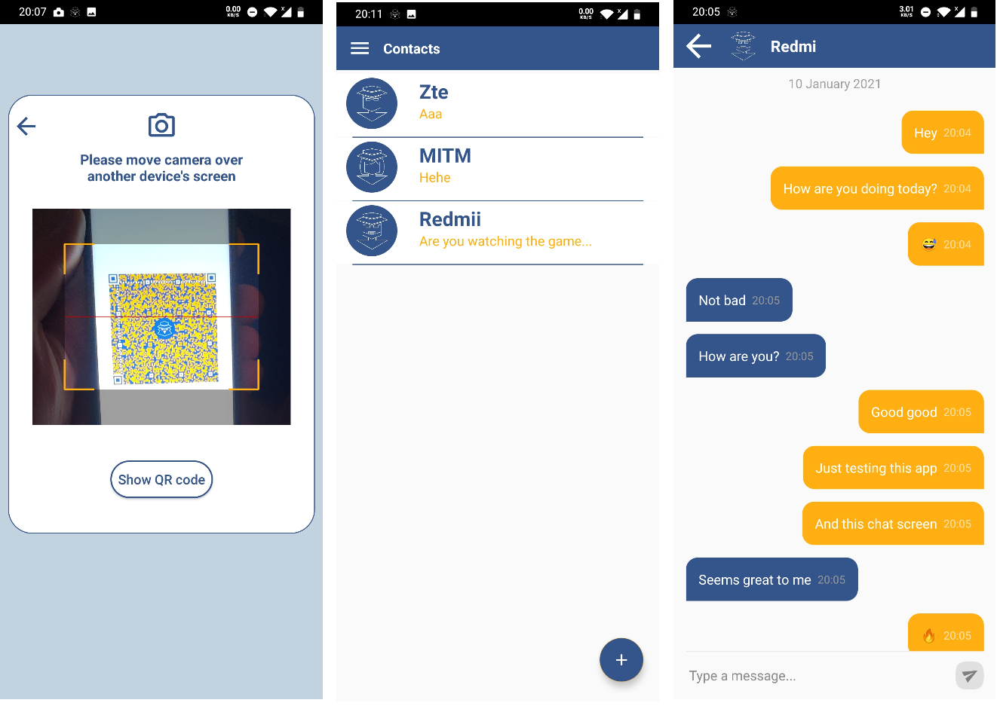

<!-- PROJECT LOGO -->
<br />
<p align="center">
  <a href="https://github.com/vasilije15/drongo">
    
  </a>

  <h3 align="center">Drongo</h3>

  <p align="center">
    Peer-To-Peer Chat Application for Android
    <br />
    <a href="https://www.fer.unizg.hr/rasip/dsd/projects/howzit_2"><strong>Project Page</strong></a>
    <br />
    <br />
    <a href="https://www.youtube.com/watch?v=zJuR0xxzUcU">View Demo</a>
    ·
    <a href="https://github.com/vasilije15/drongo/issues">Report Bug</a>
    ·
    <a href="https://github.com/vasilije15/drongo/issues">Request Feature</a>
  </p>
</p>


<!-- TABLE OF CONTENTS -->
<details open="open">
  <summary>Table of Contents</summary>
  <ol>
    <li>
      <a href="#about-the-project">About The Project</a>
      <ul>
        <li><a href="#built-with">Built With</a></li>
      </ul>
    </li>
    <li>
      <a href="#getting-started">Getting Started</a>
      <ul>
        <li><a href="#installation">Installation</a></li>
      </ul>
    </li>
    <li><a href="#usage">Usage</a></li>
  </ol>
</details>


<!-- ABOUT THE PROJECT -->
## About The Project

The goal of the Drongo project is to provide an exchange of text messages between two users without the user being obliged to submit any personal information when registering into the application.
Currently, there are applications on the market that all save exchanged messages between two users on a centralized server, creating a vulnerable point for various attacks.
To avoid this problem, our application does not use any centralized server to store messages, but the messages are saved locally.
To exchange contacts, users simply scan each other's QR code when they meet in person.
All this was done with the intention that the application has as high a level of security as possible.

Basic three requirements that this application fulfills are:
- Establish a connection with another Drongo user in person
- Maintain a list of users
- Send and receive encrypted messages

There is a story behind this name. Drongo is actually a bird, which frequently attacks much larger birds to protect their nests. 
Also, there is a fictional character named Drongo, a counter-terrorism operative employed by secret service. 
We combined the stories behind the name and came up with the logo - a bird with bright eyes and a hat. A hat represents the signature sign for detectives.


This application was built as a part of Distributed Software Development course by seven students from two universities. 

<p align="center">
  <a href="https://github.com/vasilije15/drongo/tree/master/screenshots">
      
  </a>
 

### Built With

The application is built natively in Android using Java, with the help of various open source libraries.


<!-- GETTING STARTED -->
## Getting Started

This section gives an overview of how to download and install the application. 

### Installation

This application runs on devices running Android 7.0 (Nougat) or higher (API Level 24). There are two ways to get this up and running on a device.
#### Cloning the repository 

Clone with this command and import the project manually into Android Studio

  ```sh
  git clone https://github.com/vasilije15/drongo
  ```
or use Android Studio's built in tool to 'Get from Source Control' by providing repository's link.
After you have imported the project to Android Studio, wait until Gradle is done building and run the application on an actual device.

<strong> Note: Use of emulators is discouraged since exchange of messages does not work out of the box.</strong>


#### Download and install APK
Download the APK file to your device from [here](https://github.com/vasilije15/drongo/releases/download/v1.0/Drongo.apk) and install the downloaded APK file. 
You might need to allow installation from unknown sources first and when 'Blocked by Play Protect' window pops up just press 'Install Anyway'.


## Usage

After installation, first step is to register into the application by providing a username, choosing an avatar and giving a strong enough password.
Password needs to be one of medium strength, at least 4 letters with one of them being uppercase, 3 digits and one special character.  
To add a contact, you need to click the + icon on Contacts screen and scan another contact's QR code. 
To show your QR code, you need to be connected to a Wireless Access Point. 
To exchange messages, you and your contact need to be in the same LAN (Local-Area-Network) or connected to the same Wireless Access Point.
If you and your contact move to another LAN, just scan QR codes again to update your addresses and start chatting again. 

